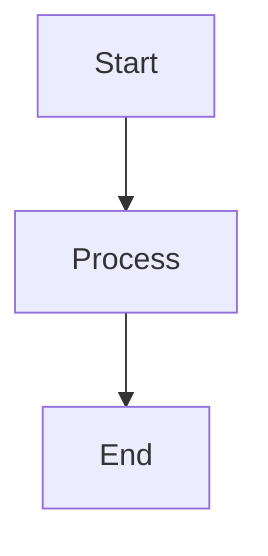

# MDX & Mermaid Solution Documentation

## Overview

This document describes the comprehensive solution implemented to fix MDX parsing errors and enable proper Mermaid diagram rendering in CelestialDocs.

## Problem Analysis

### Root Cause
The primary issue was that **MDX interprets `<` and `>` characters followed by alphanumeric characters as JSX elements**. Technical documentation frequently uses comparison operators like:
- `<10ms`, `<200ms`, `<100ms` (latency specifications)
- `>93%`, `>85%`, `>99%` (performance metrics)
- `<1 Mbps`, `<70%` (bandwidth and thresholds)

These were being parsed as invalid JSX tags like `<10ms>`, `<200ms>`, etc., causing build failures.

### Secondary Issue
Mermaid diagrams in ```mermaid code blocks were not being rendered as interactive diagrams.

## Solution Architecture

### 1. MDX Parsing Fixes

#### Automated Fixing Script (`fix-mdx-robust.js`)
- **Purpose**: Automatically escape problematic characters in MDX files
- **Features**:
  - Preserves Mermaid diagrams and code blocks
  - Escapes comparison operators (`<` → `&lt;`, `>` → `&gt;`)
  - Creates automatic backups
  - Handles multiple files or directories

**Usage**:
```bash
# Fix a single file
node fix-mdx-robust.js src/content/docs/project-overview/technical-data.mdx

# Fix all MDX files in a directory
node fix-mdx-robust.js src/content/docs
```

#### Validation Script (`validate-mdx.js`)
- **Purpose**: Proactively detect potential MDX parsing issues
- **Features**:
  - Identifies JSX parsing problems
  - Detects comparison operators that might cause issues
  - Checks for unescaped characters
  - Provides actionable suggestions

**Usage**:
```bash
# Validate all MDX files
node validate-mdx.js

# Validate specific file
node validate-mdx.js src/content/docs/project-overview/technical-data.mdx
```

### 2. Mermaid Diagram Support

#### Remark Plugin (`src/lib/remark-mermaid.js`)
- **Purpose**: Transform ```mermaid code blocks into MermaidBlock components
- **Implementation**: Uses AST transformation to replace code nodes with JSX components

#### Mermaid Components

**MermaidBlock.astro** (Server-side with client hydration):
- Server-side rendering with client-side hydration
- Automatic theme configuration
- Error handling with fallback display
- Responsive design
- Loading states

**Mermaid.tsx** (Pure React component):
- Client-side only rendering
- Advanced error handling
- Configurable themes

#### Configuration Updates
**astro.config.mjs**:
```javascript
import { remarkMermaid } from "./src/lib/remark-mermaid.js";

export default defineConfig({
  integrations: [
    mdx({
      gfm: true,
      remarkPlugins: [remarkMermaid],
    }),
  ],
});
```

## File Structure

```
CelestialDocs/
├── src/
│   ├── components/
│   │   ├── Mermaid.tsx              # React Mermaid component
│   │   └── MermaidBlock.astro       # Astro Mermaid component
│   └── lib/
│       └── remark-mermaid.js        # Remark plugin for Mermaid transformation
├── fix-mdx-robust.js                # Automated MDX fixing script
├── validate-mdx.js                  # MDX validation script
└── docs/
    └── MDX_MERMAID_SOLUTION.md      # This documentation
```

## Usage Guide

### For Content Authors

#### Writing MDX with Technical Specifications
```mdx
# ✅ Correct (after fix)
- Latency: &lt;10ms
- Performance: &gt;93% accuracy
- Bandwidth: &lt;1 Mbps

# ❌ Incorrect (causes parsing errors)
- Latency: <10ms
- Performance: >93% accuracy
- Bandwidth: <1 Mbps
```

#### Adding Mermaid Diagrams
```mdx
import MermaidBlock from '@/components/MermaidBlock.astro';

# Your content here



# More content
```

### For Developers

#### Adding New MDX Files
1. Write your MDX content normally
2. Run validation: `node validate-mdx.js path/to/your/file.mdx`
3. Fix any issues: `node fix-mdx-robust.js path/to/your/file.mdx`
4. Test the build: `pnpm run build`

#### Extending Mermaid Support
To add custom themes or configurations:

```javascript
// In MermaidBlock.astro
mermaid.default.initialize({
  startOnLoad: false,
  theme: 'your-custom-theme',
  themeVariables: {
    // Your custom theme variables
  },
});
```

## Dependencies

### Required Packages
```json
{
  "mermaid": "^11.10.0",
  "unist-util-visit": "^5.0.0"
}
```

### Development Scripts
Add to `package.json`:
```json
{
  "scripts": {
    "validate-mdx": "node validate-mdx.js",
    "fix-mdx": "node fix-mdx-robust.js src/content/docs",
    "check-mdx": "node validate-mdx.js && echo 'MDX validation passed'"
  }
}
```

## Best Practices

### 1. Content Guidelines
- **Always escape comparison operators** in technical specifications
- **Use code spans** for inline technical values: `<10ms` → `` `<10ms` ``
- **Validate before committing** using the validation script

### 2. Mermaid Diagrams
- **Keep diagrams simple** for better rendering performance
- **Test on different screen sizes** (diagrams are responsive)
- **Use meaningful node labels** for accessibility

### 3. Maintenance
- **Run validation regularly** as part of CI/CD
- **Keep backups** when using the fixing script
- **Update Mermaid version carefully** and test thoroughly

## Troubleshooting

### Common Issues

#### Build Fails with JSX Parsing Error
```bash
# Solution
node fix-mdx-robust.js src/content/docs
```

#### Mermaid Diagrams Not Rendering
1. Check if MermaidBlock is imported in the MDX file
2. Verify the diagram syntax is correct
3. Check browser console for JavaScript errors

#### Performance Issues with Large Diagrams
- Simplify complex diagrams
- Consider splitting large diagrams into smaller ones
- Use lazy loading for pages with many diagrams

### Error Messages

#### "Unexpected character before name"
- **Cause**: Unescaped `<` or `>` characters
- **Solution**: Run `fix-mdx-robust.js` on the affected file

#### "Module not found: mermaid"
- **Cause**: Missing Mermaid dependency
- **Solution**: `pnpm add mermaid`

## Testing

### Validation Workflow
```bash
# 1. Validate all MDX files
node validate-mdx.js

# 2. Fix any issues found
node fix-mdx-robust.js src/content/docs

# 3. Test build
pnpm run build

# 4. Test development server
pnpm run dev
```

### CI/CD Integration
Add to your CI pipeline:
```yaml
- name: Validate MDX
  run: node validate-mdx.js
- name: Build
  run: pnpm run build
```

## Performance Considerations

### Bundle Size
- Mermaid adds ~500KB to the client bundle
- Diagrams are lazy-loaded on page interaction
- Consider using CDN for Mermaid in production

### Rendering Performance
- Diagrams render client-side after page load
- Loading states provide good UX
- Large diagrams may cause brief layout shifts

## Future Enhancements

### Potential Improvements
1. **Server-side Mermaid rendering** for better SEO and performance
2. **Diagram caching** to avoid re-rendering on navigation
3. **Custom Mermaid themes** matching site design
4. **Diagram export functionality** (PNG/SVG)
5. **Interactive diagram features** (zoom, pan)

### Migration Path
This solution is backward-compatible and doesn't require changes to existing content beyond running the fixing script.

## Conclusion

This comprehensive solution addresses both immediate MDX parsing issues and provides robust Mermaid diagram support. The automated tools ensure maintainability, while the component architecture allows for future enhancements.

The solution is:
- ✅ **Robust**: Handles edge cases and provides error recovery
- ✅ **Maintainable**: Automated tools and clear documentation
- ✅ **Performant**: Optimized loading and rendering
- ✅ **Extensible**: Component-based architecture for future features
- ✅ **Developer-friendly**: Clear error messages and debugging tools
