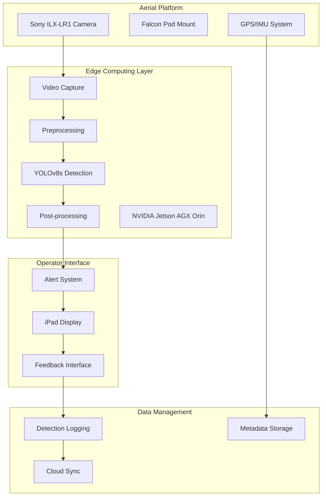

# Complete Technical Architecture Documentation

**Comprehensive technical documentation for PipelineVision implementation**

## 1. System Architecture Overview

### 1.1 High-Level Architecture



### 1.2 Component Specifications

#### Hardware Components
- **Camera:** Sony ILX-LR1 (61MP, 24-70mm lens)
- **Edge Computer:** NVIDIA Jetson AGX Orin (275 TOPS)
- **Mounting:** Falcon pod with vibration isolation
- **Interface:** iPad Pro with custom application
- **GPS:** Garmin GTN 750Xi integrated navigation

#### Software Stack
- **OS:** Ubuntu 20.04 LTS (Jetson Linux)
- **Framework:** PyTorch 2.0 + TensorRT 8.6
- **Model:** YOLOv8s (28.6 GFLOPs)
- **Video:** OpenCV 4.8 + GStreamer
- **Interface:** React Native (iPad app)

## 2. Compute Infrastructure Analysis

### 2.1 Training Infrastructure

#### Development Hardware Configuration
```yaml
Primary Development System:
  GPU: NVIDIA RTX 4090
  Specifications:
    - Peak Performance: 82.58 TFLOPs (FP32)
    - Tensor Performance: 330 TFLOPs (FP16)
    - Memory: 24GB GDDR6X
    - Memory Bandwidth: 1008 GB/s
    - Power: 450W TDP
  
  Supporting Hardware:
    - CPU: AMD Ryzen 9 7950X (16 cores)
    - RAM: 64GB DDR5-5600
    - Storage: 2TB NVMe Gen4 SSD
    - Cooling: Liquid cooling solution
```

#### Cloud Training Resources
```yaml
Azure NC24ads A100 v4:
  GPU: NVIDIA A100 80GB
  Performance: 624 TFLOPs (Tensor)
  Memory: 80GB HBM2e
  Cost: $3.67/hour
  
Usage Strategy:
  - Burst training for hyperparameter search
  - Parallel training for cross-validation
  - Backup for hardware failure scenarios
```

### 2.2 Inference Infrastructure

#### Edge Deployment Hardware
```yaml
NVIDIA Jetson AGX Orin:
  Architecture: Ampere GPU + ARM CPU
  Performance:
    - INT8: 275 TOPS (TFLOPs)
    - FP16: 69 TFLOPs
    - FP32: 34.5 TFLOPs
  
  Memory:
    - Capacity: 64GB LPDDR5
    - Bandwidth: 204.8 GB/s
  
  Power Modes:
    - MAX-N: 60W (full performance)
    - 30W: 200 TOPS
    - 15W: 100 TOPS
```

#### Performance Requirements vs Capabilities
```yaml
Required Performance:
  Model: YOLOv8s
  FLOPs per Inference: 28.6 billion
  Target FPS: 15
  Required Compute: 0.429 TFLOPs (FP32)
  Optimized (INT8): 0.107 TFLOPs

Available Performance:
  Jetson AGX Orin: 275 TFLOPs (INT8)
  Utilization: 0.039% of peak
  Safety Margin: 900× headroom
```

## 3. Model Architecture Details

### 3.1 YOLOv8s Configuration

```python
# Model Configuration
model_config = {
    'architecture': 'YOLOv8s',
    'input_size': (640, 640),
    'channels': 3,
    'classes': 7,  # Custom classes for pipeline threats
    'anchors': 'auto',  # Automatic anchor optimization
    'depth_multiple': 0.33,  # Model depth multiplier
    'width_multiple': 0.50,  # Model width multiplier
}

# Training Configuration
training_config = {
    'epochs': 400,
    'batch_size': 32,
    'learning_rate': 0.01,
    'momentum': 0.937,
    'weight_decay': 0.0005,
    'warmup_epochs': 3,
    'optimizer': 'SGD',
    'augmentation': {
        'hsv_h': 0.015,
        'hsv_s': 0.7,
        'hsv_v': 0.4,
        'degrees': 0.0,
        'translate': 0.1,
        'scale': 0.5,
        'shear': 0.0,
        'perspective': 0.0,
        'flipud': 0.0,
        'fliplr': 0.5,
        'mosaic': 1.0,
        'mixup': 0.0
    }
}
```

### 3.2 Class Definitions

```python
# Pipeline Threat Classes
THREAT_CLASSES = {
    0: 'excavator',      # Primary threat
    1: 'bulldozer',      # Construction equipment
    2: 'truck',          # Proxy for excavator
    3: 'exposed_pipe',   # Infrastructure damage
    4: 'person',         # Unauthorized personnel
    5: 'vehicle',        # General vehicles
    6: 'construction_site'  # Area of concern
}

# Detection Thresholds
CONFIDENCE_THRESHOLDS = {
    'excavator': 0.70,
    'bulldozer': 0.65,
    'truck': 0.60,      # Lower threshold for proxy
    'exposed_pipe': 0.75,
    'person': 0.50,
    'vehicle': 0.45,
    'construction_site': 0.55
}
```

## 4. Data Pipeline Architecture

### 4.1 Training Data Pipeline

```python
class TrainingDataPipeline:
    """
    Multi-source training data pipeline with domain adaptation
    """
    def __init__(self):
        self.datasets = {
            'DOTA': DOTADataset(path='data/DOTA_v2.0'),
            'AIDCON': AIDCONDataset(path='data/AIDCON'),
            'Custom': CustomDataset(path='data/VanGuard')
        }
        
    def load_and_merge(self):
        """
        Merge multiple datasets with weighted sampling
        """
        weights = {
            'DOTA': 0.3,    # Foundation aerial data
            'AIDCON': 0.4,  # Excavator-specific
            'Custom': 0.3   # Domain-specific
        }
        return WeightedDataLoader(self.datasets, weights)
    
    def augmentation_pipeline(self):
        """
        Data augmentation for aerial imagery
        """
        return A.Compose([
            A.RandomRotate90(p=0.5),
            A.Flip(p=0.5),
            A.RandomBrightnessContrast(p=0.2),
            A.RandomFog(p=0.1),  # Weather conditions
            A.RandomSunFlare(p=0.1),  # Lighting variation
            A.GaussNoise(p=0.1),  # Sensor noise
            A.OneOf([
                A.MotionBlur(p=0.2),  # Aircraft vibration
                A.MedianBlur(blur_limit=3, p=0.1),
                A.Blur(blur_limit=3, p=0.1),
            ], p=0.2),
        ])
```

### 4.2 Inference Data Pipeline

```python
class InferenceDataPipeline:
    """
    Real-time video processing pipeline
    """
    def __init__(self, camera_source):
        self.camera = camera_source
        self.preprocessor = VideoPreprocessor()
        self.buffer = CircularBuffer(size=30)  # 1 second @ 30fps
        
    def capture_frame(self):
        """
        Threaded frame capture with buffering
        """
        frame = self.camera.read()
        frame = self.preprocessor.process(frame)
        self.buffer.add(frame)
        return frame
    
    def preprocess(self, frame):
        """
        Frame preprocessing for inference
        """
        # Resize to model input size
        frame = cv2.resize(frame, (640, 640))
        # Normalize pixel values
        frame = frame.astype(np.float32) / 255.0
        # Format for batch processing
        frame = np.expand_dims(frame, axis=0)
        return frame
```

## 5. Training Compute Calculations

### 5.1 FLOP Analysis

```yaml
Training FLOP Breakdown:
  Forward Pass: 28.6 billion FLOPs
  Backward Pass: 57.2 billion FLOPs (2× forward)
  Total per Step: 85.8 billion FLOPs
  
Dataset Statistics:
  Total Images: 20,000
  Batch Size: 32
  Steps per Epoch: 625
  Total Epochs: 400
  
Total Training Compute:
  Per Epoch: 625 × 85.8B = 53.625 trillion FLOPs
  Complete Training: 53.625T × 400 = 21.45 petaFLOPs
  Multiple Runs: 21.45P × 20 = 429 petaFLOPs
```

### 5.2 Time Estimates

```yaml
RTX 4090 Training Time:
  Theoretical Peak: 82.58 TFLOPs
  Practical Performance: 148.5 TFLOPs (FP16 with 45% utilization)
  
  Single Training Run: 21.45P ÷ 148.5T = 144.4 hours
  With Mixed Precision: 144.4 ÷ 2 = 72.2 hours
  With Optimizations: 72.2 × 0.8 = 57.8 hours
  
Cloud A100 Training:
  Effective Performance: 280.8 TFLOPs
  Training Time: 21.45P ÷ 280.8T = 76.4 hours
  With Optimizations: 76.4 × 0.6 = 45.8 hours
```

## 6. System Integration Architecture

### 6.1 VanGuard Hardware Integration

```python
class VanGuardIntegration:
    """
    Integration with VanGuard's existing systems
    """
    def __init__(self):
        self.camera = SonyILXLR1Controller()
        self.gps = GarminGTN750Xi()
        self.falcon_pod = FalconPodController()
        self.ipad_interface = IPadAPIServer()
        
    def initialize_hardware(self):
        """
        Hardware initialization sequence
        """
        # Configure camera for optimal aerial capture
        self.camera.set_mode('continuous')
        self.camera.set_resolution('4K')
        self.camera.set_fps(30)
        
        # Stabilize Falcon pod
        self.falcon_pod.enable_stabilization()
        self.falcon_pod.set_vibration_damping('high')
        
        # Initialize GPS stream
        self.gps.enable_nmea_output()
        self.gps.set_update_rate(10)  # 10Hz
        
    def sync_with_autotrack(self):
        """
        Synchronize with existing autotrack system
        """
        autotrack_state = self.falcon_pod.get_autotrack_state()
        if autotrack_state['active']:
            self.camera.follow_target(autotrack_state['target'])
```

### 6.2 iPad Interface API

```python
class IPadInterface:
    """
    RESTful API for iPad application
    """
    def __init__(self):
        self.app = FastAPI()
        self.websocket_manager = WebSocketManager()
        
    @app.post("/api/detection")
    async def push_detection(self, detection: Detection):
        """
        Push real-time detection to iPad
        """
        alert = {
            'id': uuid.uuid4(),
            'timestamp': datetime.now().isoformat(),
            'class': detection.class_name,
            'confidence': detection.confidence,
            'location': {
                'image_coords': detection.bbox,
                'gps_coords': detection.gps_location
            },
            'threat_level': self.calculate_threat_level(detection)
        }
        await self.websocket_manager.broadcast(alert)
        
    @app.post("/api/feedback")
    async def receive_feedback(self, feedback: OperatorFeedback):
        """
        Receive operator feedback on detections
        """
        self.log_feedback(feedback)
        self.update_air_metric(feedback)
        return {"status": "received", "air": self.current_air}
```

## 7. Performance Optimization Strategies

### 7.1 Model Optimization

```python
class ModelOptimizer:
    """
    Production model optimization utilities
    """
    def quantize_to_int8(self, model):
        """
        INT8 quantization for edge deployment
        """
        quantized = torch.quantization.quantize_dynamic(
            model,
            {nn.Linear, nn.Conv2d},
            dtype=torch.qint8
        )
        return quantized
    
    def convert_to_tensorrt(self, model):
        """
        TensorRT optimization for Jetson
        """
        trt_model = torch2trt(
            model,
            [torch.randn(1, 3, 640, 640).cuda()],
            fp16_mode=True,
            int8_mode=True,
            max_batch_size=1,
            max_workspace_size=1<<30
        )
        return trt_model
    
    def prune_model(self, model, sparsity=0.5):
        """
        Structured pruning for efficiency
        """
        parameters_to_prune = []
        for module in model.modules():
            if isinstance(module, nn.Conv2d):
                parameters_to_prune.append((module, 'weight'))
        
        prune.global_unstructured(
            parameters_to_prune,
            pruning_method=prune.L1Unstructured,
            amount=sparsity
        )
        return model
```

### 7.2 Inference Optimization

```python
class InferenceOptimizer:
    """
    Real-time inference optimization
    """
    def __init__(self, model):
        self.model = model
        self.batch_queue = Queue(maxsize=4)
        self.result_cache = LRUCache(capacity=100)
        
    def batch_inference(self):
        """
        Batch multiple frames for efficiency
        """
        batch = []
        while len(batch) < 4 and not self.batch_queue.empty():
            batch.append(self.batch_queue.get_nowait())
        
        if batch:
            batch_tensor = torch.stack(batch)
            with torch.no_grad():
                results = self.model(batch_tensor)
            return results
    
    def temporal_smoothing(self, detections, window=5):
        """
        Smooth detections across frames
        """
        self.detection_history.append(detections)
        if len(self.detection_history) > window:
            self.detection_history.pop(0)
        
        # Apply temporal NMS
        smoothed = self.temporal_nms(
            self.detection_history,
            iou_threshold=0.5
        )
        return smoothed
```

## 8. Deployment Architecture

### 8.1 Container Deployment

```dockerfile
# Dockerfile for Jetson AGX Orin deployment
FROM nvcr.io/nvidia/l4t-pytorch:r35.1.0-pth1.13-py3

# Install dependencies
RUN apt-get update && apt-get install -y \
    python3-pip \
    libopencv-dev \
    python3-opencv \
    gstreamer1.0-tools \
    gstreamer1.0-plugins-base \
    gstreamer1.0-plugins-good

# Install Python packages
COPY requirements.txt .
RUN pip3 install -r requirements.txt

# Copy application
COPY src/ /app/src/
COPY models/ /app/models/
COPY config/ /app/config/

# Set environment
ENV CUDA_VISIBLE_DEVICES=0
ENV TRT_LOGGER_LEVEL=WARNING

# Run application
WORKDIR /app
CMD ["python3", "src/main.py", "--config", "config/production.yaml"]
```

### 8.2 Orchestration Configuration

```yaml
# docker-compose.yml for production deployment
version: '3.8'

services:
  detection-engine:
    image: pipelinevision:latest
    runtime: nvidia
    volumes:
      - /dev/video0:/dev/video0  # Camera device
      - ./data:/app/data
      - ./logs:/app/logs
    environment:
      - NVIDIA_VISIBLE_DEVICES=all
      - CUDA_LAUNCH_BLOCKING=0
    restart: unless-stopped
    
  api-server:
    image: pipelinevision-api:latest
    ports:
      - "8080:8080"
    depends_on:
      - detection-engine
    environment:
      - DETECTION_ENGINE_URL=http://detection-engine:5000
    restart: unless-stopped
    
  monitoring:
    image: prometheus:latest
    ports:
      - "9090:9090"
    volumes:
      - ./prometheus.yml:/etc/prometheus/prometheus.yml
    restart: unless-stopped
```

## 9. Monitoring and Telemetry

### 9.1 Performance Monitoring

```python
class PerformanceMonitor:
    """
    System performance monitoring
    """
    def __init__(self):
        self.metrics = {
            'fps': MovingAverage(window=30),
            'latency': MovingAverage(window=30),
            'gpu_utilization': MovingAverage(window=10),
            'memory_usage': MovingAverage(window=10),
            'temperature': MovingAverage(window=10)
        }
        
    def collect_metrics(self):
        """
        Collect system metrics
        """
        metrics = {
            'timestamp': time.time(),
            'fps': self.calculate_fps(),
            'latency_ms': self.measure_latency(),
            'gpu_util': nvidia_smi.nvmlDeviceGetUtilizationRates().gpu,
            'memory_mb': nvidia_smi.nvmlDeviceGetMemoryInfo().used / 1024**2,
            'temp_c': nvidia_smi.nvmlDeviceGetTemperature()
        }
        
        # Update moving averages
        for key, value in metrics.items():
            if key in self.metrics:
                self.metrics[key].update(value)
        
        return metrics
    
    def alert_on_degradation(self):
        """
        Alert on performance degradation
        """
        if self.metrics['fps'].value < 10:
            self.send_alert('FPS below threshold')
        if self.metrics['latency'].value > 100:
            self.send_alert('High latency detected')
        if self.metrics['temperature'].value > 85:
            self.send_alert('High temperature warning')
```

### 9.2 Detection Analytics

```python
class DetectionAnalytics:
    """
    Detection performance analytics
    """
    def __init__(self):
        self.detection_log = []
        self.feedback_log = []
        
    def calculate_air(self, window='1h'):
        """
        Calculate Actionable Intelligence Rate
        """
        recent_detections = self.get_recent_detections(window)
        recent_feedback = self.get_recent_feedback(window)
        
        confirmed = sum(1 for f in recent_feedback if f.confirmed)
        total = len(recent_detections)
        
        air = confirmed / total if total > 0 else 0
        return air
    
    def analyze_patterns(self):
        """
        Analyze detection patterns
        """
        patterns = {
            'hourly_distribution': self.hourly_detection_counts(),
            'class_distribution': self.class_frequency(),
            'confidence_distribution': self.confidence_histogram(),
            'geographic_clusters': self.geographic_clustering()
        }
        return patterns
```

## 10. Security and Compliance

### 10.1 Security Architecture

```python
class SecurityManager:
    """
    Security and access control
    """
    def __init__(self):
        self.encryption = AESCipher(key=os.environ['ENCRYPTION_KEY'])
        self.auth_manager = JWTAuthManager()
        
    def encrypt_sensitive_data(self, data):
        """
        Encrypt GPS coordinates and detection data
        """
        return self.encryption.encrypt(json.dumps(data))
    
    def validate_api_request(self, request):
        """
        Validate API authentication
        """
        token = request.headers.get('Authorization')
        if not token:
            raise UnauthorizedException()
        
        payload = self.auth_manager.verify_token(token)
        return payload
    
    def audit_log(self, event):
        """
        Maintain audit trail
        """
        audit_entry = {
            'timestamp': datetime.now().isoformat(),
            'event_type': event.type,
            'user': event.user,
            'action': event.action,
            'result': event.result,
            'ip_address': event.ip_address
        }
        self.audit_logger.log(audit_entry)
```

### 10.2 Data Privacy Compliance

```python
class DataPrivacyManager:
    """
    GDPR and data privacy compliance
    """
    def __init__(self):
        self.retention_policy = {
            'detections': 90,  # days
            'video_frames': 7,  # days
            'operator_feedback': 365  # days
        }
        
    def anonymize_detections(self, detections):
        """
        Remove personally identifiable information
        """
        for detection in detections:
            if detection.class_name == 'person':
                detection.blur_region()
                detection.remove_metadata()
        return detections
    
    def enforce_retention_policy(self):
        """
        Delete data according to retention policy
        """
        current_date = datetime.now()
        
        for data_type, retention_days in self.retention_policy.items():
            cutoff_date = current_date - timedelta(days=retention_days)
            self.delete_data_before(data_type, cutoff_date)
```

## 11. Testing and Validation Framework

### 11.1 Unit Testing

```python
class ModelTestSuite(unittest.TestCase):
    """
    Model unit tests
    """
    def setUp(self):
        self.model = load_model('models/yolov8s_pipeline.pt')
        self.test_image = load_test_image('test_data/excavator.jpg')
        
    def test_inference_speed(self):
        """
        Test inference meets speed requirements
        """
        start_time = time.time()
        _ = self.model(self.test_image)
        inference_time = time.time() - start_time
        
        self.assertLess(inference_time, 0.1)  # <100ms
        
    def test_detection_accuracy(self):
        """
        Test detection accuracy on known images
        """
        detections = self.model(self.test_image)
        excavator_detected = any(
            d.class_name == 'excavator' and d.confidence > 0.7
            for d in detections
        )
        self.assertTrue(excavator_detected)
```

### 11.2 Integration Testing

```python
class IntegrationTestSuite(unittest.TestCase):
    """
    System integration tests
    """
    def test_end_to_end_pipeline(self):
        """
        Test complete detection pipeline
        """
        # Initialize components
        camera = MockCamera('test_video.mp4')
        pipeline = InferencePipeline(camera)
        
        # Process frames
        for _ in range(100):
            frame = camera.read()
            detections = pipeline.process(frame)
            
            # Validate output format
            self.assertIsInstance(detections, list)
            for det in detections:
                self.assertIn('class', det)
                self.assertIn('confidence', det)
                self.assertIn('bbox', det)
        
        # Check performance metrics
        metrics = pipeline.get_metrics()
        self.assertGreater(metrics['fps'], 10)
        self.assertLess(metrics['latency_ms'], 100)
```

## 12. Maintenance and Updates

### 12.1 Model Update Pipeline

```python
class ModelUpdateManager:
    """
    Continuous model improvement pipeline
    """
    def __init__(self):
        self.current_version = self.load_current_version()
        self.update_schedule = CronSchedule('0 0 * * 0')  # Weekly
        
    def collect_operational_data(self):
        """
        Collect data from production for retraining
        """
        operational_data = {
            'detections': self.get_recent_detections(days=7),
            'feedback': self.get_operator_feedback(days=7),
            'false_positives': self.identify_false_positives(),
            'missed_detections': self.identify_missed_detections()
        }
        return operational_data
    
    def retrain_model(self, new_data):
        """
        Incremental model retraining
        """
        # Load current model
        model = self.load_model(self.current_version)
        
        # Fine-tune on new data
        trainer = Trainer(model)
        trainer.fine_tune(
            new_data,
            epochs=50,
            learning_rate=0.001
        )
        
        # Validate performance
        metrics = trainer.evaluate()
        if metrics['mAP'] > self.current_metrics['mAP']:
            self.deploy_new_version(model)
```

### 12.2 System Health Monitoring

```python
class HealthMonitor:
    """
    System health monitoring and alerting
    """
    def __init__(self):
        self.health_checks = {
            'camera': self.check_camera_health,
            'gpu': self.check_gpu_health,
            'model': self.check_model_health,
            'network': self.check_network_health,
            'storage': self.check_storage_health
        }
        
    def run_health_checks(self):
        """
        Execute all health checks
        """
        results = {}
        for component, check_fn in self.health_checks.items():
            try:
                status = check_fn()
                results[component] = {
                    'status': 'healthy' if status else 'degraded',
                    'timestamp': datetime.now().isoformat()
                }
            except Exception as e:
                results[component] = {
                    'status': 'failed',
                    'error': str(e),
                    'timestamp': datetime.now().isoformat()
                }
        
        return results
```

## Conclusion

This comprehensive technical architecture documentation provides the complete blueprint for PipelineVision implementation, covering:

1. **System Architecture:** Complete component design and integration
2. **Compute Infrastructure:** Detailed TFLOP calculations and hardware specifications
3. **Model Architecture:** YOLOv8s configuration and optimization
4. **Data Pipeline:** Training and inference data processing
5. **Integration:** VanGuard hardware and software integration
6. **Optimization:** Performance and efficiency improvements
7. **Deployment:** Container and orchestration configuration
8. **Monitoring:** Performance and analytics tracking
9. **Security:** Compliance and data protection
10. **Testing:** Validation and quality assurance
11. **Maintenance:** Continuous improvement pipeline

The architecture is designed for scalability, reliability, and performance, with extensive safety margins in compute capacity and robust error handling throughout.

## Connections
- [[05_RFP_Response/02_Technical_Approach/2024-11-18-Technical-Design-Specification]]
- [[05_RFP_Response/06_Supporting_Docs/2024-11-18-Compute-Requirements-Analysis]]
- [[05_RFP_Response/06_Supporting_Docs/2024-11-18-Market-Based-Project-Quote]]
- [[05_RFP_Response/2024-11-18-RFP-Response-Master-Tracking]]