import { Card } from '@/components/docs/Card';
import MermaidBlock from '@/components/MermaidBlock.astro';

## Executive Summary

PipelineVision transforms VanGuard's Falcon pod platform with real-time AI threat detection through automated identification of construction equipment, fallen trees, and pipeline hazards. Our edge-first architecture intends to ensure **zero workflow disruption** while achieving **85%+ Actionable Intelligence Rate**

**Key Technical Differentiators:**
- **First-to-Market**: Real-time AI threat detection for pipeline inspection
- **Edge-Native**: No connectivity dependencies, complete onboard processing
- **Seamless Integration**: Drop-in enhancement to existing Falcon pod systems

---

## System Context & Business Impact

### Strategic Position

PipelineVision addresses the critical gap in VanGuard's market-leading methane detection capability—automating visual threat identification that currently relies on human vigilance across 4-6 hour flights. This system prevents the $30-60 billion in annual excavator strike damages while establishing VanGuard's competitive moat in AI-powered inspection.

### Operational Integration

---

## System Architecture

### High-Level Design

PipelineVision employs a modular, edge-first architecture optimized for real-time threat detection during aerial pipeline inspection flights, designed for seamless integration with VanGuard's proven Falcon pod platform.

---

## Data Architecture & Training Strategy

### Multi-Tier Data Foundation

Our data strategy addresses the critical challenge of pipeline-specific threat detection through a progressive, three-tier approach that maximizes model performance while minimizing custom data requirements.

#### Tier 1: Foundation Dataset (DOTA + VisDrone)
- **Source**: DOTA (Dataset for Object Detection in Aerial Images)
- **Volume**: 11,268 professionally annotated aerial images
- **Coverage**: 15 object categories including vehicles, aircraft, ships
- **Value**: Provides aerial perspective baseline and geometric understanding
- **Performance**: 93.8% mAP@0.5 on aerial vehicle detection benchmarks

#### Tier 2: Domain Transfer (AIDCON)
- **Source**: AIDCON Construction Equipment Dataset
- **Volume**: 9,563 construction equipment objects across 3,000+ images
- **Coverage**: Excavators, bulldozers, cranes, trucks from ground perspective
- **Value**: Construction equipment domain knowledge for transfer learning
- **Strategy**: Bridge gap between aerial and ground-based equipment detection

#### Tier 3: Pipeline-Specific Collection (To be determined)
- **Source**: VanGuard operational flights and targeted collection
- **Volume**: 500-1,000+ professionally annotated pipeline corridor images
- **Coverage**: Seasonal variations, lighting conditions, threat scenarios
- **Value**: Domain-specific optimization for VanGuard's operational environment

### Proxy Detection Strategy

**Challenge**: Limited pipeline-specific training data for excavator detection  
**Solution**: Use alternative class as excavator proxy with 70%+ correlation threshold  
**Validation**: Progressive refinement with custom VanGuard data collection  
**Risk Mitigation**: Parallel development of custom classes to reduce proxy dependence

### Performance-Driven Data Pipeline

---

## Core Technology Stack

### AI & Computer Vision Pipeline
- **Model Architecture**: YOLOv8x for edge optimization
  - **Base Training**: COCO dataset (80 classes, 330K images)
  - **Aerial Enhancement**: DOTA dataset fine-tuning (11,268 images)
  - **Domain Specialization**: AIDCON construction equipment (9,563 objects)
  - **Pipeline Optimization**: VanGuard custom dataset (500-1,000+ images)
- **Performance Metrics**: 
  - **Accuracy**: 93.8% mAP@0.5 on aerial vehicle detection
  - **Speed**: 15+ FPS sustained inference on Jetson AGX Orin or similar
- **Inference Framework**: PyTorch → ONNX → TensorRT optimization pipeline

### Edge Computing Platform
- **Hardware**: NVIDIA Jetson AGX Orin (64GB Configuration) or similar hardware
  - **AI Performance**: TOPS TBD
  - **Memory**: TBD (selected for model caching and video buffering)
- **Software Stack**:
  - **OS**: JetPack v5.1 (Ubuntu-based)
- **Container Runtime**: Docker with NVIDIA Container Toolkit
  - **AI Runtime**: TensorRT v8.5+ with CUDA v11.8
  - **Development**: Python v3.11+, OpenCV v4.8+, PyTorch v2.0+

### Video Processing & Synchronization
- **Input Source**: Sony ILX-LR1 Industrial Camera System
  - **Resolution**: 12MP native (4096 x 3000), processed at 1920x1080
  - **Frame Rate**: 30 FPS capture, 15 FPS inference processing
  - **Interface**: USB3 Vision compliant with GenICam standard
  - **Synchronization**: GPS timestamp correlation with <10ms accuracy
- **Processing Pipeline**:
  - **Frame Buffering**: 2-second rolling buffer for quality selection
  - **Preprocessing**: Resolution scaling, color normalization, contrast enhancement
  - **Inference Batching**: Dynamic batching for optimal GPU utilization
  - **Post-processing**: Non-Maximum Suppression

---

## Deployment Architecture & MVP Progression

#### MVP-0: Cloud Proof-of-Concept (Month 1)
**Investment**: $5,000 | **Effort**: 70 hours | **Risk Level**: Low

- **Infrastructure**: AWS/Azure GPU instances for cloud processing
- **Data Source**: VanGuard archived flight footage + DOTA/AIDCON/VisDrone datasets
- **Validation Target**: 70%+ detection on proxy threat classes
- **Key Deliverables**: Architecture diagram, performance baseline, go/no-go analysis, and related documentation
- **Success Gate**: Proven proxy strategy effectiveness before hardware investment

#### MVP-1: Edge Demonstration (Months 2-3)  
**Investment**: $5,000 | **Effort**: 70 hours | **Risk Level**: Medium

- **Infrastructure**: NVIDIA Jetson AGX Orin development kit with live processing (or similar)
- **Data Source**: Custom VanGuard dataset (500-1,000 annotated images) + live video feeds
- **Validation Target**: 15+ FPS sustained processing with measurable accuracy improvement
- **Key Deliverables**: Fine-tuned model, edge hardware prototype, live demo system
- **Success Gate**: Real-time edge performance validated before aircraft integration

#### MVP-2: Aircraft Integration (Months 4-6)
**Investment**: $TBD | **Effort**: TBD hours | **Risk Level**: Medium-High

- **Infrastructure**: Production Jetson AGX Orin integrated into Falcon pod platform
- **Data Source**: Sony ILX-LR1 live feed with full GPS/KMZ correlation
- **Validation Target**: 85%+ Actionable Intelligence Rate with 99%+ system uptime
- **Key Deliverables**: Production system, iPad integration, field test report, operator training
- **Success Gate**: Operational flight validation with zero workflow disruption

---

## Testing & Validation Framework

### Multi-Layer Testing Strategy (In-Progress)

Our testing approach ensures system reliability across development, integration, and operational phases while maintaining the high standards required for mission-critical aviation systems.

```mermaid
graph TD
    subgraph "Unit Testing Layer"
        A[Model Performance Tests<br/>Accuracy, Speed, Memory] --> B[Component Integration Tests<br/>API, Data Flow, Error Handling]
    end
    
    subgraph "System Testing Layer"
        B --> C[End-to-End Pipeline Tests<br/>Camera → Detection → Alert]
        C --> D[Performance Stress Tests<br/>Extended Runtime, Edge Cases]
    end
    
    subgraph "Operational Testing Layer"
        D --> E[Ground Integration Tests<br/>Falcon Pod, iPad Interface]
        E --> F[Flight Validation Tests<br/>Real Operational Conditions]
    end
    
    subgraph "Continuous Validation"
        F --> G[Operator Feedback Loop<br/>AIR Tracking, False Positive Analysis]
        G --> H[Model Performance Monitoring<br/>Drift Detection, Retraining Triggers]
    end
    


```

### Network Architecture & Connectivity

#### Connectivity Strategy
- **Primary Mode**: Full offline operation (no connectivity required)
- **Secondary Mode**: Opportunistic sync when WiFi/cellular available
- **Data Bandwidth**: <1 Mbps for alert thumbnails and metadata
- **Storage Strategy**: 7-day local retention with cloud sync for long-term analytics

---

## Future Roadmap & Scaling Opportunities

### Advanced AI Capabilities
- **Multi-Threat Expansion**: Fallen trees, exposed pipes, personnel, unauthorized vehicles
- **Seasonal Adaptation**: Dynamic model adjustment for environmental conditions
- **Predictive Analytics**: Threat pattern recognition and risk scoring
- **Sensor Fusion**: Integration with thermal, LiDAR, and hyperspectral sensors

### Operational Scaling
- **Fleet Deployment**: Standardized rollout across VanGuard's aircraft fleet
- **Continuous Learning**: Automated model improvement from operational data
- **Advanced Analytics**: Fleet-wide threat intelligence and trend analysis
- **Integration Expansion**: Connection with maintenance and reporting systems

### Market Expansion
- **Multi-Operator Platform**: Adaptation for other pipeline inspection companies
- **Infrastructure Expansion**: Power lines, railways, highway infrastructure
- **International Markets**: Regulatory compliance for global operations
- **Partnership Ecosystem**: Integration with complementary technology providers

---

## Related Documentation

<Card href="/project-planning/rfp-response" title="📋 RFP Response & Statement of Work" icon="">
  Complete proposal with MVP phases, pricing, and engagement model
</Card>

<Card href="/project-planning" title="📋 Implementation Planning" icon="">
  Comprehensive project planning with MVP phases and timeline
</Card>

<Card href="/library" title="📚 Research Library" icon="">
  Academic research, competitive analysis, and technical references
</Card>

<Card href="/project-overview/core-hypotheses" title="🧪 Core Hypotheses" icon="">
  Fundamental assumptions and validation strategies
</Card>

